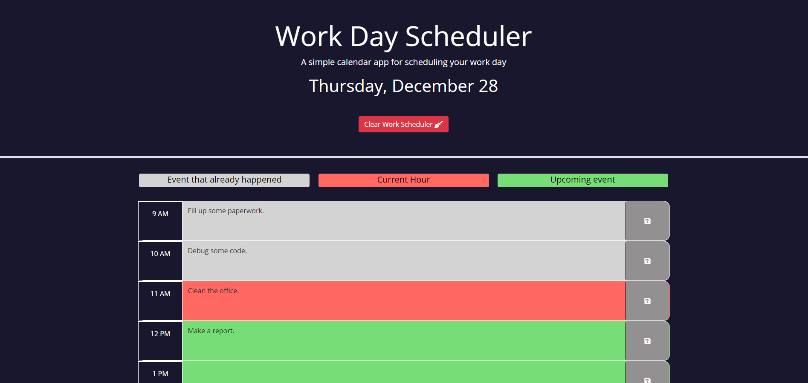
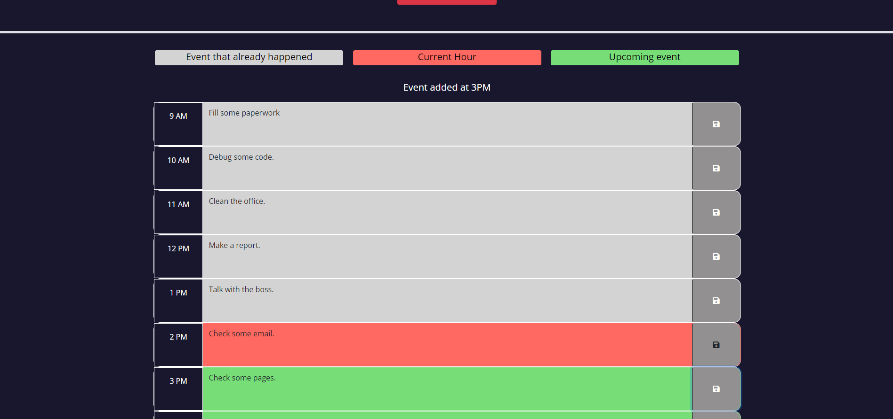

# Work Day Scheduler
   

## Description  :bookmark_tabs:

This project was really fascinating because I could practice the usage of the LocalStorage and new tools like jQuery and dayjs. Moreover it was pretty cool to work on a project with those new tools, it really made me look over some notes and pages to fully understand the usage of them and see a simpler way of some code.  The functionality of the application is to create a work scheduler throughout the day, so you can add and delete events and the app will let you know which task you have to do at that specific hour. In brief, I learned how to use third party API's such GoogleFonts, FontAwesome, jQuery, dayjs, etc., and implement them to my projects.

## Installation :computer:

You are able to use the work day scheduler and see my code ahead:

 1. If you want to try the actual application, you can go to this URL: https://stroyer210.github.io/work-day-scheduler/
 2. If you want to see my code, you have my repository's folder on top, plus all the documents, such HTML, CSS and JavaScript.

## Usage :bar_chart:
If you are unable to open the URL, I attached a screenshot of it below:
    ---
    
    ---
    
    ---
    
After you open the application, you can see the actual date on top, and some blocks underneath that you can add events every hour. After you type the event you have to save it by clicking the disc emoji on the right side of the textarea. Every hour the color of the event will change, letting you know what you have to do at that specific hour.
Additionaly, you can start the day over by clicking the button called "Clear work scheduler" which will delete any events that were already made.

## Credits :email:

List of all the links that made me succeed this project:
- https://getbootstrap.com/docs/4.0/utilities/spacing/
- https://getbootstrap.com/docs/4.0/components/buttons/
- https://fontawesome.com/search?q=broom&o=r
- https://developer.mozilla.org/en-US/docs/Web/API/Window/localStorage
- https://www.w3schools.com/jquery/jquery_hide_show.asp
- https://day.js.org/docs/en/display/format

## License :memo:
---
---
MIT License

Copyright (c) 2023 Sergio S. Ardila-Alvarado

Permission is hereby granted, free of charge, to any person obtaining a copy
of this software and associated documentation files (the "Software"), to deal
in the Software without restriction, including without limitation the rights
to use, copy, modify, merge, publish, distribute, sublicense, and/or sell
copies of the Software, and to permit persons to whom the Software is
furnished to do so, subject to the following conditions:

The above copyright notice and this permission notice shall be included in all
copies or substantial portions of the Software.

THE SOFTWARE IS PROVIDED "AS IS", WITHOUT WARRANTY OF ANY KIND, EXPRESS OR
IMPLIED, INCLUDING BUT NOT LIMITED TO THE WARRANTIES OF MERCHANTABILITY,
FITNESS FOR A PARTICULAR PURPOSE AND NONINFRINGEMENT. IN NO EVENT SHALL THE
AUTHORS OR COPYRIGHT HOLDERS BE LIABLE FOR ANY CLAIM, DAMAGES OR OTHER
LIABILITY, WHETHER IN AN ACTION OF CONTRACT, TORT OR OTHERWISE, ARISING FROM,
OUT OF OR IN CONNECTION WITH THE SOFTWARE OR THE USE OR OTHER DEALINGS IN THE
SOFTWARE.

---
---
